### MIGRATION TO THE CLOUD AND CONTAINERIZATION PART 1: DOCKER AND DOCKER COMPOSE

#### Install Docker and prepare for migration to the Cloud

Installed Docker engine on my Ubuntu server.

    sudo apt-get update

    sudo apt-get install docker-ce docker-ce-cli containerd.io

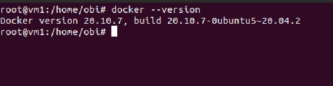

MySQL in container

Pull MySQL Docker image from Docker Hub

    docker pull mysql/mysql-server:latest

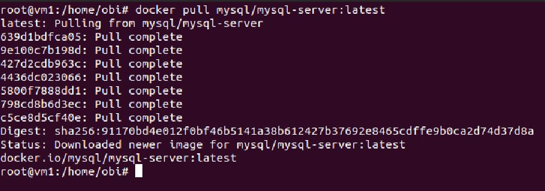

Run command below to list image downloaded
Deploy the MySQL Container

    docker run -e MYSQL_ROOT_PASSWORD=password1 -d mysql/mysql-server:latest

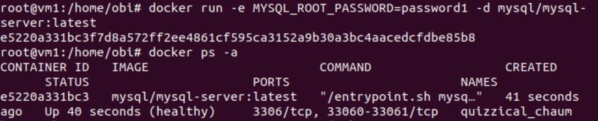

CONNECTING TO THE MYSQL DOCKER CONTAINER

The MYSQL server container can be connected directly or through another container running MYSQL client.

#### 1st Approach:

Connecting directly to the container running the MySQL server:

    docker exec -it quizzical_chaum mysql -uroot -p

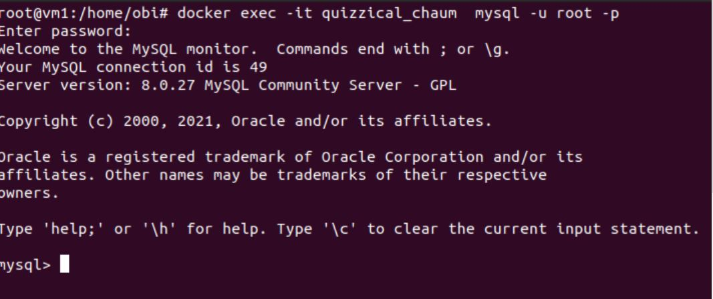

#### 2nd Approach:

#### Create a network

    docker network create --subnet=172.18.0.0/24 tooling_app_network

Create an environment variable to store the root password:

    export MYSQL_PW=password1

Pull the image and run the container:

    docker run --network tooling_app_network -h mysqlserverhost --name=mysql-server -e MYSQL_ROOT_PASSWORD=$MYSQL_PW -d mysql/mysql-server:latest

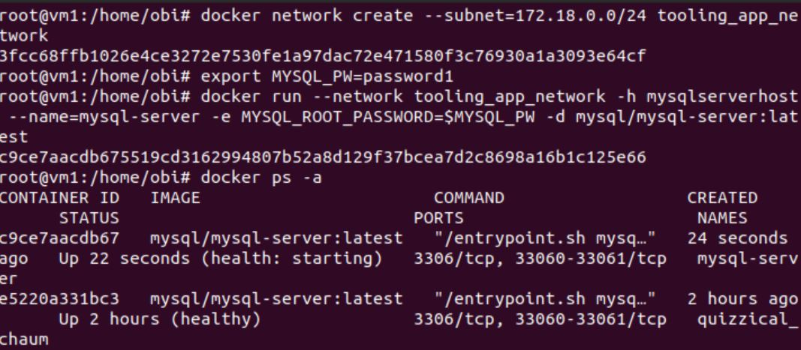

Create a ‘create_user.sql’ file then enter the code below

    CREATE USER ''@'%' IDENTIFIED BY ''; GRANT ALL PRIVILEGES ON * . * TO ''@'%';

Run the script 

    docker exec -i mysql-server mysql -uroot -p$MYSQL_PW < ./create_user.sql

Run the MySQL client container:

    docker run --network tooling_app_network --name mysql-client -it --rm mysql mysql -h mysqlserverhost -u  -p

### Prepare Database Schema

Setup a database schema to allow the tooling application to connect to the database server.

Clone the tooling app repository

    git clone https://github.com/darey-devops/tooling.git

Export the location of the SQL file

    export tooling_db_schema=./tooling/html/tooling_db_schema.sql

Use the SQL script to create the database and prepare the schema

    docker exec -i mysql-server mysql -uroot -p$MYSQL_PW < $tooling_db_schema

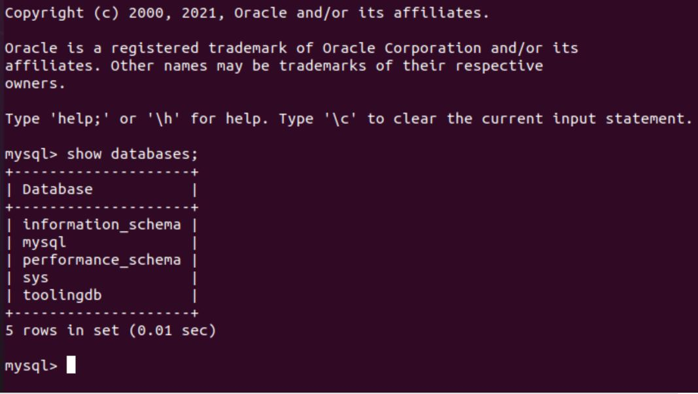

Update the db_conn.php file with connection details to the database

    $servername = "mysqlserverhost"; $username = ""; $password = ""; $dbname = "toolingdb"; 

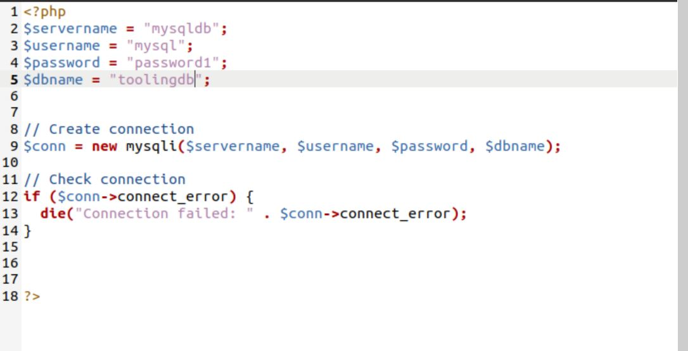

#### Run the Tooling app

Containerization of an application starts with the creation of a file with a special name - 'Dockerfile'.

The Dockerfile can be considered as an instruction to the Docker on how to package application in a container.

In the tooling directory, open Dockerfile and enter the code below:

FROM php:7.4.24-apache-buster

LABEL Dare=dare@zooto.io

RUN apt-get update --fix-missing && apt-get install -y \
    default-mysql-client
    
RUN docker-php-ext-install pdo_mysql 

RUN docker-php-ext-install mysqli

COPY apache-config.conf /etc/apache2/sites-available/000-default.conf

COPY start-apache /usr/local/bin

RUN a2enmod rewrite

#Copy application source

ADD html/. /var/www

RUN chown -R www-data:www-data /var/www

CMD ["start-apache"]

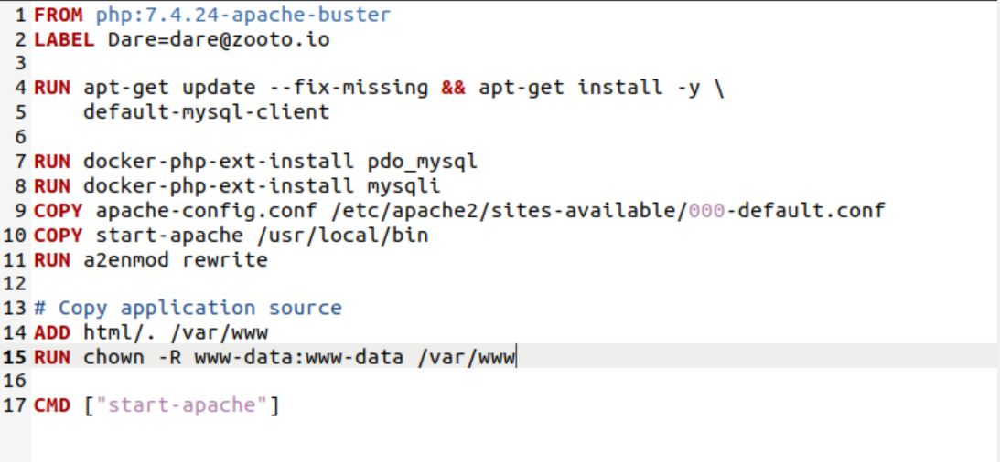

Build the Docker image. In the tooling directory, run the Dockerfile

    docker build -t tooling:0.0.1 .

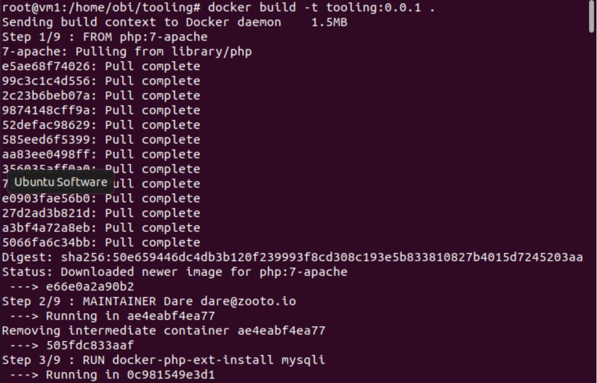
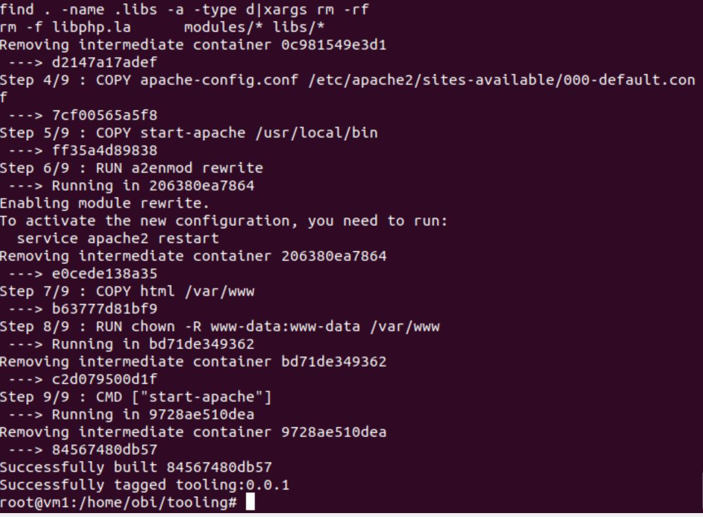

In the above command,  -t parameter was used to tag the image tooling"0.0.1 

The parameter instructs Docker to locate the Dockerfile in the directory where the command is run. 

Run the container

    docker run --network tooling_app_network -p 8085:80 -it tooling:0.0.1

### Deploy Tooling app using Docker Compose

Run this command to download the current stable release of Docker Compose:

    sudo curl -L "https://github.com/docker/compose/releases/download/1.29.2/docker-compose-$(uname -s)-$(uname -m)" -o /usr/local/bin/docker-compose

Apply executable permissions to the binary:

    sudo chmod +x /usr/local/bin/docker-compose

Test the installation.

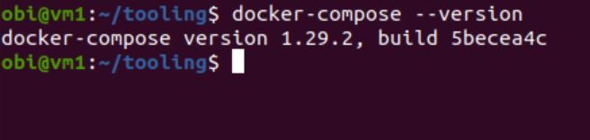

Create a file – tooling.yaml
Enter the code below into the file to represent the application deployment

    version: "3.9"

    services:

    db:
    image: mysql/mysql-server:latest
    environment:
      MYSQL_DATABASE: "${DB_DATABASE}"
      MYSQL_USER: "${DB_USER}"
      MYSQL_PASSWORD: "${DB_PASSWORD}"
      MYSQL_ROOT_PASSWORD: "${DB_ROOT_PASSWORD}"
    ports:
      - "${DB_PORT}:3306"
    volumes:
      - db:/var/lib/mysql

    app:
    build:
      context: .
    container_name: tooling-website
    restart: unless-stopped
    volumes:
      - ~/html/.:/var/www/html
    ports:
      - "${APP_PORT}:80"
    links:
      - db
    depends_on:
      - db
  
    volumes:
    db:

Create a .env file to reference the variables in the tooling.yml file, then enter the database variables as shown below.

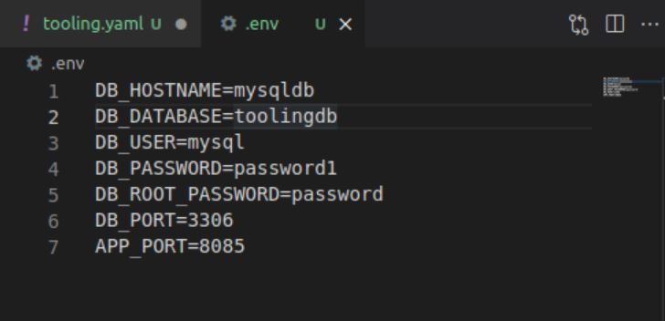

Run the command below to start the container

docker-compose -f tooling.yaml  up -d

Opened http://localhost:8085 on my Ubuntu web browser (virtual box)

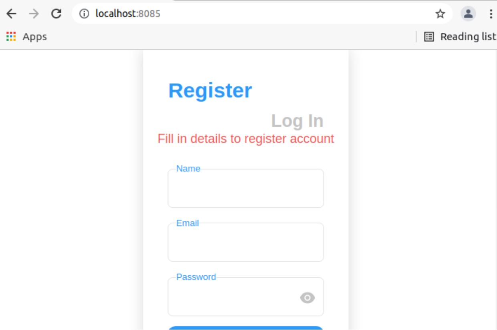
       

### Implement a POC to migrate the PHP-Todo app into a containerized application.

Clone the php-todo repo https://github.com/obi-0/php-todo

In the php-todo directory, write a Docker file for the php-todo app.

    FROM php:7.4.24-apache
    LABEL Dare=dare@zooto.io

    #install zip, unzip extension, git, mysql-client
    RUN apt-get update --fix-missing && apt-get install -y \
    default-mysql-client \
    git \
    unzip \
    zip \
    curl \
    wget
  
    #Install docker php dependencies
    RUN docker-php-ext-install pdo_mysql mysqli

    #Add config files and binary file and enable webserver
    COPY apache-config.conf /etc/apache2/sites-available/000-default.conf
    COPY start-apache /usr/local/bin
    RUN a2enmod rewrite

    RUN curl -sS https://getcomposer.org/installer |php && mv composer.phar /usr/local/bin/composer

    #Copy application source
    COPY . /var/www
    RUN chown -R www-data:www-data /var/www

    EXPOSE 80

    CMD ["start-apache"]

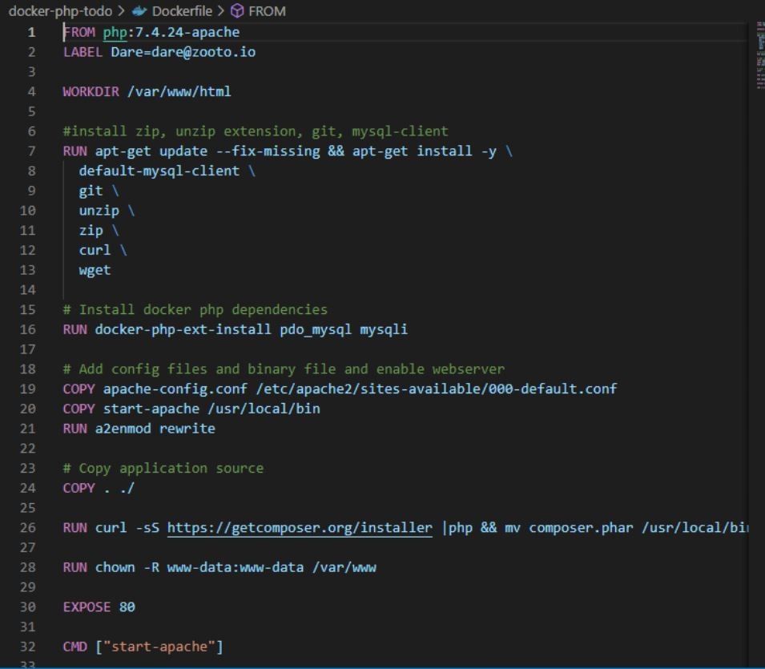

 Open the start-apache file and add the code below:

composer install --no-plugins --no-scripts

php artisan migrate
php artisan key:generate
php artisan db:seed

apache2-foreground

start-apache file should look like this

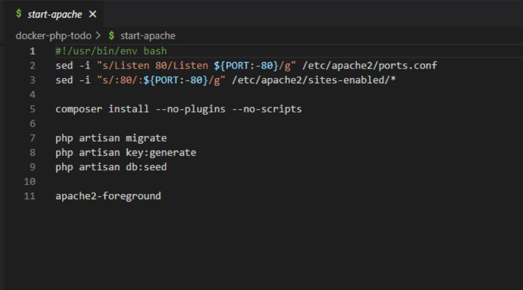

Create a docker-compose.yml and enter the code below:

    version: "3.9"
    services:
    app:
    build:
      context: .
    container_name: php-website
    network_mode: tooling_app_network
    restart: unless-stopped
    volumes:
      - app:/php-todo
    ports:
      - "${APP_PORT}:80"
    depends_on:
      - db

    db:
    image: mysql/mysql-server:latest
    container_name: php-db-server
    network_mode: tooling_app_network
    hostname: "${DB_HOSTNAME}"
    restart: unless-stopped
    environment:
      MYSQL_DATABASE: "${DB_DATABASE}"
      MYSQL_USER: "${DB_USERNAME}"
      MYSQL_PASSWORD: "${DB_PASSWORD}"
      MYSQL_ROOT_PASSWORD: "${DB_ROOT_PASSWORD}"
    
    ports:
      - "${DB_PORT}:3306"

    volumes:
      - db:/var/lib/mysql

    volumes:
    app:
    db:

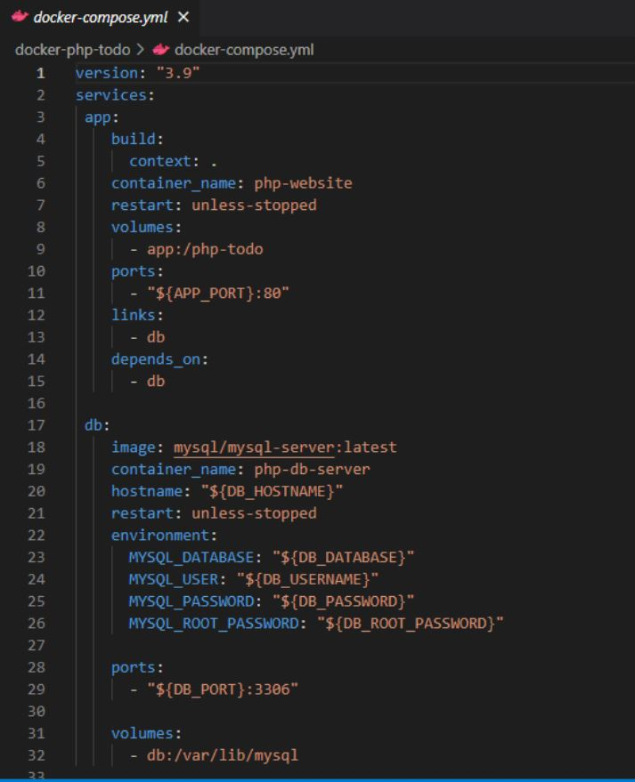

Update the .env file

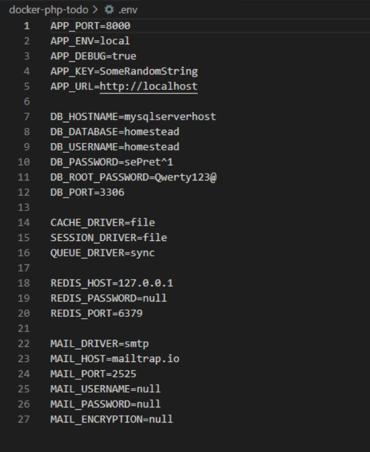

 
 Build image by running the command below:

    docker build -t php-todo:latest .

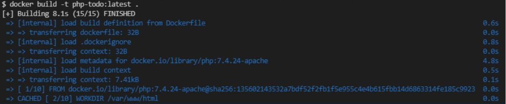

Run command to deploy containers:

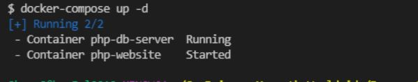

Create an account in Docker Hub

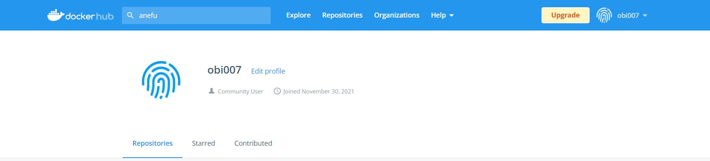

Create a docker repository

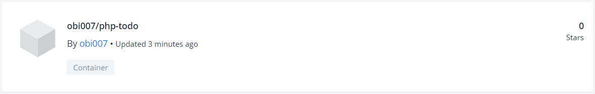

Create tag for the image

    docker tag php-todo:latest obi007/php-todo:1.0.0

Run command to login to dockerhub 

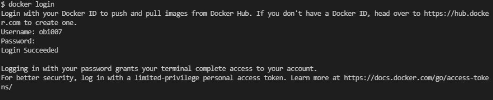

Pushed docker image to my dockerhub repository

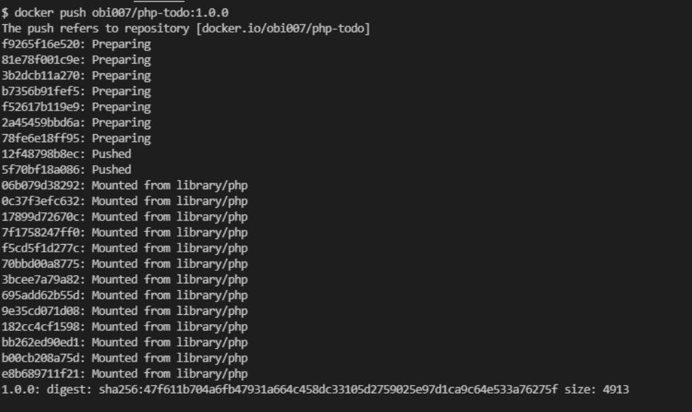

docker images in my docker hub repository

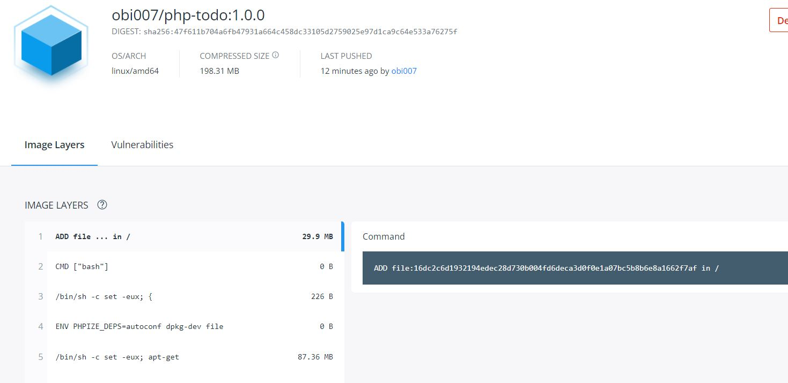

