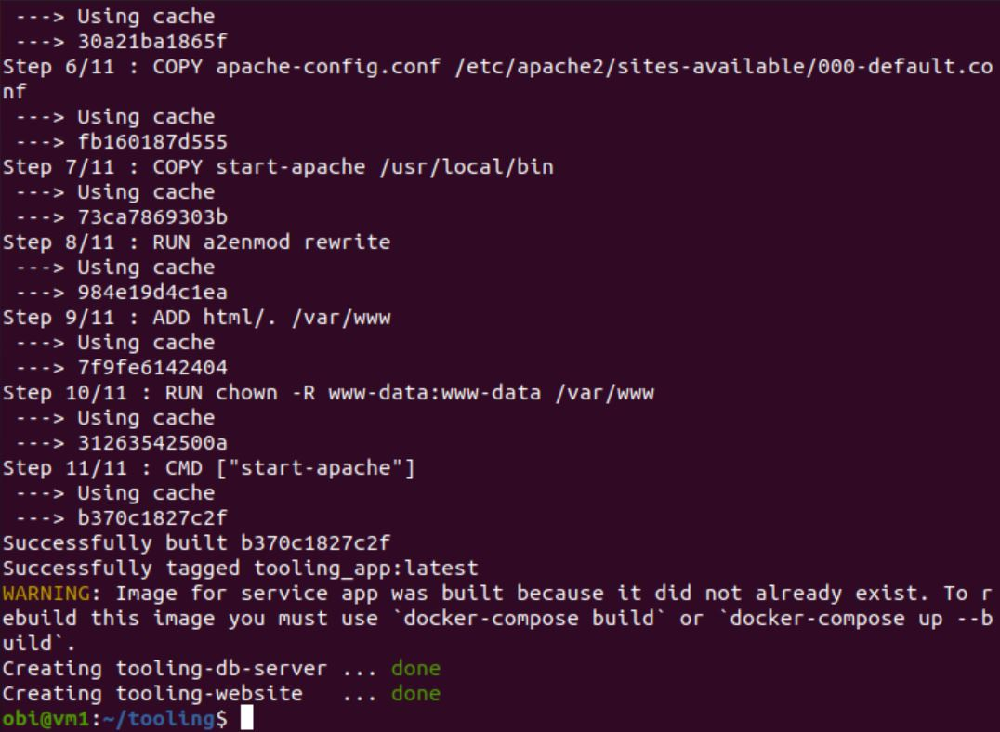
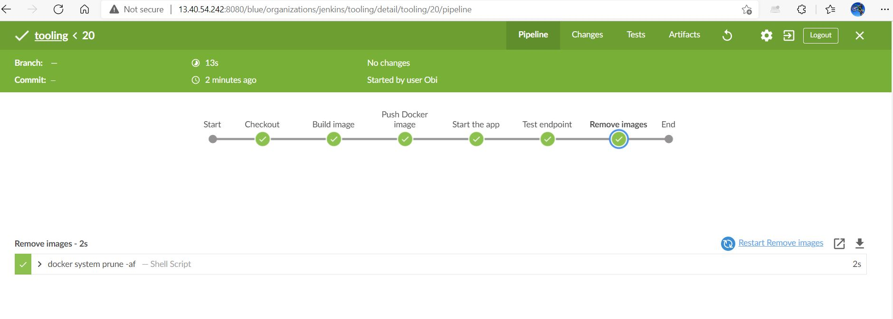

### MIGRATION TO THE CLOUD AND CONTAINERIZATION PART 1: DOCKER AND DOCKER COMPOSE

#### Install Docker and prepare for migration to the Cloud

Step 1:

Installed Docker engine on my Linux (Ubuntu) server.

    sudo apt-get update

    sudo apt-get install docker-ce docker-ce-cli containerd.io

Step 2:

Pull MySQL Docker image from Docker Hub

    docker pull mysql/mysql-server:latest

Step 3:

Run command below to list image downloaded
Deploy the MySQL Container

    docker run -e MYSQL_ROOT_PASSWORD=password1 -d mysql/mysql-server:latest

CONNECT TO MYSQL DOCKER CONTAINER

The MYSQL server container can be connected directly or through another container running MYSQL client.

#### 1st Approach:

Connecting directly to the container running the MySQL server:

    docker exec -it quizzical_chaum mysql -uroot -p

#### 2nd Approach:

#### Create a network

    docker network create --subnet=172.18.0.0/24 tooling_app_network

Create an environment variable to store the root password:

    export MYSQL_PW=password1

Pull the image and run the container:

    docker run --network tooling_app_network -h mysqlserverhost --name=mysql-server -e MYSQL_ROOT_PASSWORD=$MYSQL_PW -d mysql/mysql-server:latest

Create a ‘create_user.sql’ file then enter the code below

    CREATE USER ''@'%' IDENTIFIED BY ''; GRANT ALL PRIVILEGES ON * . * TO ''@'%';

Run the script 

    docker exec -i mysql-server mysql -uroot -p$MYSQL_PW < ./create_user.sql

Run the MySQL client container:

    docker run --network tooling_app_network --name mysql-client -it --rm mysql mysql -h mysqlserverhost -u  -p

### Prepare Database Schema

Setup a database schema to allow the tooling application to connect to the database server.

Clone the tooling app repository

    git clone https://github.com/darey-devops/tooling.git

Export the location of the SQL file

    export tooling_db_schema=./tooling/html/tooling_db_schema.sql

Use the SQL script to create the database and prepare the schema

    docker exec -i mysql-server mysql -uroot -p$MYSQL_PW < $tooling_db_schema

Update the db_conn.php file with connection details to the database

    $servername = "mysqlserverhost"; $username = ""; $password = ""; $dbname = "toolingdb"; 

#### Run the Tooling app

Containerization of an application starts with the creation of a file with a special name - 'Dockerfile'.

The Dockerfile can be considered as an instruction to the Docker on how to package application in a container.

In the tooling directory, open Dockerfile and enter the code below:

FROM php:7.4.24-apache-buster

LABEL Dare=dare@zooto.io

RUN apt-get update --fix-missing && apt-get install -y \
    default-mysql-client
    
RUN docker-php-ext-install pdo_mysql 

RUN docker-php-ext-install mysqli

COPY apache-config.conf /etc/apache2/sites-available/000-default.conf

COPY start-apache /usr/local/bin

RUN a2enmod rewrite

#Copy application source

ADD html/. /var/www

RUN chown -R www-data:www-data /var/www

CMD ["start-apache"]

Build the Docker image. In the tooling directory, run the Dockerfile

    docker build -t tooling:0.0.1 .

In the above command,  -t parameter was used to tag the image tooling"0.0.1 

The parameter instructs Docker to locate the Dockerfile in the directory where the command is run. 

Run the container

    docker run --network tooling_app_network -p 8085:80 -it tooling:0.0.1

### Deploy Tooling app using Docker Compose

Run this command to download the current stable release of Docker Compose:

    sudo curl -L "https://github.com/docker/compose/releases/download/1.29.2/docker-compose-$(uname -s)-$(uname -m)" -o /usr/local/bin/docker-compose

Apply executable permissions to the binary:

    sudo chmod +x /usr/local/bin/docker-compose

Test the installation.

Create a file – tooling.yaml
Enter the code below into the file to represent the application deployment

    version: "3.9"

    services:

    db:
    image: mysql/mysql-server:latest
    environment:
      MYSQL_DATABASE: "${DB_DATABASE}"
      MYSQL_USER: "${DB_USER}"
      MYSQL_PASSWORD: "${DB_PASSWORD}"
      MYSQL_ROOT_PASSWORD: "${DB_ROOT_PASSWORD}"
    ports:
      - "${DB_PORT}:3306"
    volumes:
      - db:/var/lib/mysql

    app:
    build:
      context: .
    container_name: tooling-website
    restart: unless-stopped
    volumes:
      - ~/html/.:/var/www/html
    ports:
      - "${APP_PORT}:80"
    links:
      - db
    depends_on:
      - db
  
    volumes:
    db:

Create a .env file to reference the variables in the tooling.yml file, then enter the database variables as shown below.

Run the command below to start the container

docker-compose -f tooling.yaml  up -d

Open the URL http://localhost:8085 on web browser

       

### Implement a POC to migrate the PHP-Todo app into a containerized application.

#### Part 1

Clone the php-todo repo https://github.com/obi-0/php-todo

In the php-todo directory, write a Docker file for the php-todo app.

    FROM php:7.4.24-apache
    LABEL Dare=dare@zooto.io

    #install zip, unzip extension, git, mysql-client
    RUN apt-get update --fix-missing && apt-get install -y \
    default-mysql-client \
    git \
    unzip \
    zip \
    curl \
    wget
  
    #Install docker php dependencies
    RUN docker-php-ext-install pdo_mysql mysqli

    #Add config files and binary file and enable webserver
    COPY apache-config.conf /etc/apache2/sites-available/000-default.conf
    COPY start-apache /usr/local/bin
    RUN a2enmod rewrite

    RUN curl -sS https://getcomposer.org/installer |php && mv composer.phar /usr/local/bin/composer

    #Copy application source
    COPY . /var/www
    RUN chown -R www-data:www-data /var/www

    EXPOSE 80

    CMD ["start-apache"]

 Open the start-apache file and add the code below:

    composer install --no-plugins --no-scripts

    php artisan migrate
    php artisan key:generate
    php artisan db:seed
    apache2-foreground

'start-apache' file looks like this:

Create a docker-compose.yml and enter the code below:

    version: "3.9"
    services:
    app:
    build:
      context: .
    container_name: php-website
    network_mode: tooling_app_network
    restart: unless-stopped
    volumes:
      - app:/php-todo
    ports:
      - "${APP_PORT}:80"
    depends_on:
      - db

    db:
    image: mysql/mysql-server:latest
    container_name: php-db-server
    network_mode: tooling_app_network
    hostname: "${DB_HOSTNAME}"
    restart: unless-stopped
    environment:
      MYSQL_DATABASE: "${DB_DATABASE}"
      MYSQL_USER: "${DB_USERNAME}"
      MYSQL_PASSWORD: "${DB_PASSWORD}"
      MYSQL_ROOT_PASSWORD: "${DB_ROOT_PASSWORD}"
    
    ports:
      - "${DB_PORT}:3306"

    volumes:
      - db:/var/lib/mysql

    volumes:
    app:
    db:

Update the .env file

 
 Build image by running the command below:

    docker build -t php-todo:latest .

Run command to deploy containers:

#### Part 2

Create an account in Docker Hub

Create a docker repository

Create a tag for the image

    docker tag php-todo:latest obi007/php-todo:1.0.0

Run command to login to dockerhub 

Pushed docker image to my dockerhub repository

#### Part 3

1.	Write a Jenkinsfile that will simulate a Docker Build and a Docker Push to the registry.

2.	Connect repository to Jenkins.
3.	Create a multi-branch pipeline.
4.	Simulate a CI pipeline from a feature and master branch using previously created Jenkinsfile.
5.	Ensure that the tagged images from your Jenkinsfile have a prefix that suggests which branch the image was pushed from. 
6.	Verify that the images pushed from the CI can be found at the registry.

Install docker engine
          
    sudo apt-get update
    sudo apt-get install docker-ce docker-ce-cli containerd.io

 Install Java runtime 

    sudo apt install openjdk-11-jdk

Run command below to install Jenkins 

    wget -q -O - https://pkg.jenkins.io/debian-stable/jenkins.io.key | sudo apt-key add -
    sudo sh -c 'echo deb https://pkg.jenkins.io/debian-stable binary/ > \
    /etc/apt/sources.list.d/jenkins.list'
    sudo apt-get update
    sudo apt-get install jenkins

#### Setup Jenkinsfile Pipeline

First, install the following plugins in Jenkins

•	Blue Ocean

•	Docker

•	Docker Compose Build Step

•	HTTP Request

Create Jenkinsfile for Docker build and push to registry

    pipeline {
    
    agent any
    
    environment {
        dockerImage = ''
        registry = 'obi007/docker-php-todo'
    }
    
    stages {
        stage('Checkout') {
            steps {
                checkout([$class: 'GitSCM', branches: [[name: '*/main']], extensions: [], userRemoteConfigs: [[url: 'https://github.com/obi-0/docker-php-todo.git']]])
            }
        }
        
        stage('Build image') {
            steps {
          sh "docker build -t obi007/docker-php-todo:1.0 ."
        }
      }
      stage('Push Docker image') {
        steps {
            withCredentials([string(credentialsId: 'docker-pwd', variable: 'DockerHubPwd')]) {
              sh "docker login -u obi007 -p ${DockerHubPwd}"
           }
           sh "docker push obi007/docker-php-todo:1.0"
   
       }    
      } 
     }
    }   
   
    

•	Connect GitHub repository to Jenkins

•	Create a multibranch pipeline

•	Simulate a Docker push

#### Deployment with Docker Compose

•	Install docker compose 

    sudo curl -L "https://github.com/docker/compose/releases/download/1.27.4/docker-compose-$(uname -s)-$(uname -m)" -o /usr/local/bin/docker-compose

Set the correct permissions so that the docker-compose command is executable:

    sudo chmod +x /usr/local/bin/docker-compose

•	Create a tooling.yaml file and enter the code below

    version: "3.9"
    services:
    tooling_frontend:
    build: .
    ports:
    - "5000:80"
    volumes:
    - tooling_frontend:/var/www/html
    links:
    - db
    db:
    image: mysql:5.7
    restart: always
    environment:
    MYSQL_DATABASE: <The database name required by Tooling app >
    MYSQL_USER: <The user required by Tooling app >
    MYSQL_PASSWORD: <The password required by Tooling app >
    MYSQL_RANDOM_ROOT_PASSWORD: '1'
    volumes:
    - db:/var/lib/mysql
    volumes:
    tooling_frontend:
    db:

Run command to start containers

    docker-compose -f tooling.yaml  up -d 

#### Complete Continuous Integration With A Test Stage

version "3.9" specifies the version of the docker-compose API.

services’ defines configurations applied to containers when docker-compose up is run.

tooling_frontend’ specifies the name of the first service.

build instructs docker-compose to build an image from Dockerfile.

ports attaches port 5000 on the instance to port 80 on the container.

volumes attaches a path on the host instance to containers created for the service.

links connects one container to another (tooling_frontend to db in this case).

db defines the database service.

image specifies the image to use for the containers, if it isn't available on the instance, it is pulled from Docker Hub.

restart instructs the container how frequently to restart.
      
environment is used to pass environment variables required for the service running in the container.

Update Jenkinsfile with a test stage before pushing image to the registry.

•	Create a job in Jenkins

•	Update Jenkinsfile

    pipeline {
    
    agent any
    
    environment {
        dockerImage = ''
        registry = 'obi007/tooling'
    }
    
    stages {
        stage('Checkout') {
            steps {
                checkout([$class: 'GitSCM', branches: [[name: '*/main']], extensions: [], userRemoteConfigs: [[url: 'https://github.com/obi-0/docker-php-todo.git']]])
            }
        }
        
        stage('Build image') {
            steps {
          sh "docker build -t obi007/tooling:1.0 ."
        }
      }
      stage('Push Docker image') {
        steps {
            withCredentials([string(credentialsId: 'docker-pwd', variable: 'DockerHubPwd')]) {
              sh "docker login -u obi007 -p ${DockerHubPwd}"
           }
           sh "docker push obi007/tooling:1.0"
   
        }    
      }
      stage("Start the app") {
          steps {
              sh "docker-compose up -d"
       }
      }
      stage("Test endpoint") {
          steps {
              script {
                  while (true) {
                      def response = httpRequest 'http://localhost:8000'
                      if (response.status == 200) {
                          withCredentials([string(credentialsId: 'docker-pwd', variable: 'DockerHubPwd')]) {
                              sh "docker login -u obi007 -p ${DockerHubPwd}"
                          }
                              sh "docker push obi007/tooling:1.0"
            }
            break
         }
        }
      }
    }
    stage ("Remove images") {
      steps {
          sh "docker system prune -af"
       }
      }
     }
    } 
 
   

